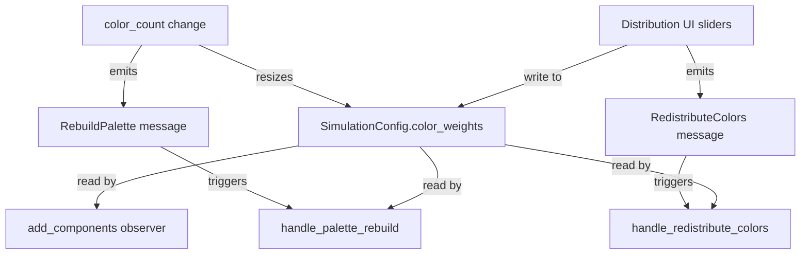

# Design Document: Color Distribution Panel

## Overview

This feature adds a `color_weights: Vec<f64>` field to `SimulationConfig` and a corresponding "Distribution" collapsing section in the egui settings panel. The weights control the probability that each color index is assigned when particles spawn or are recolored. Adjusting a slider live-redistributes all existing particles via a new `RedistributeColors` message.

The design is minimal: one new field, one new UI section, one new message, and modifications to two existing sampling call sites (the `add_components` observer and `handle_palette_rebuild`).

## Architecture



**Data flow:**
1. User moves a weight slider → `color_weights` updated with redistribution → `RedistributeColors` emitted
2. `handle_redistribute_colors` reads `color_weights`, builds a `WeightedIndex`, resamples every particle's color
3. On spawn, `add_components` reads `color_weights` and samples via `WeightedIndex`
4. On palette rebuild (color_count change), `handle_palette_rebuild` uses `WeightedIndex` instead of uniform random

## Components and Interfaces

### Modified: `SimulationConfig`

```rust
pub struct SimulationConfig {
    // ... existing fields ...
    pub color_weights: Vec<f64>,
}
```

New methods:

```rust
impl SimulationConfig {
    /// Resizes color_weights to match color_count, preserving sum = 1.0.
    /// - Growing: new entries get equal share taken proportionally from existing.
    /// - Shrinking: removed weight redistributed proportionally among remaining.
    pub fn resize_weights(&mut self) { ... }

    /// Adjusts weight at `index` to `new_value`, redistributing the difference
    /// evenly among all other weights. Maintains sum = 1.0.
    pub fn set_weight(&mut self, index: usize, new_value: f64) { ... }
}
```

`Default::default()` initializes `color_weights` to `vec![1.0 / color_count as f64; color_count]`.

`clamp_all()` extended to clamp each weight to `[0.0, 1.0]` then normalize so the vector sums to 1.0.

### New: `RedistributeColors` message

```rust
#[derive(Message)]
pub struct RedistributeColors;
```

Registered via `app.add_message::<RedistributeColors>()` in `SettingsPanelPlugin::build`.

### Modified: `add_components` observer (bodies.rs)

Gains access to `Res<SimulationConfig>` to read `color_weights` and sample via `WeightedIndex` instead of uniform `random_range`.

### Modified: `handle_palette_rebuild` (settings_panel.rs)

After rebuilding palette and force matrix, uses `WeightedIndex` from `config.color_weights` for recoloring instead of `rng.random_range(0..color_count)`.

### New: `handle_redistribute_colors` system

```rust
fn handle_redistribute_colors(
    config: Res<SimulationConfig>,
    palette: Res<Palette>,
    mut query: Query<(&mut MeshMaterial3d<StandardMaterial>, &mut PointColor), With<PointBody>>,
) { ... }
```

Registered to run on `on_message::<RedistributeColors>`. Builds a `WeightedIndex` from `config.color_weights`, iterates all particles, resamples color, updates `PointColor` and `MeshMaterial3d`. Position and velocity are untouched (not queried as mutable).

### Modified: `render_panel` (settings_panel.rs)

Adds a "Distribution" `CollapsingHeader` between "Simulation" and "Appearance" sections. Contains one slider per color with range `[0.0, 1.0]`, step `0.01`. On change, calls `config.set_weight(i, new_val)` and emits `RedistributeColors`.

## Data Models

### `color_weights: Vec<f64>`

- Length: always equals `config.color_count` (1–9)
- Range per entry: `[0.0, 1.0]`
- Sum invariant: all entries sum to `1.0` (within f64 epsilon ≈ 1e-10)
- Initialized as uniform: `[1/n, 1/n, ..., 1/n]`

### Resize logic

**Growing** (old_count → new_count where new_count > old_count):
```
share = 1.0 / new_count
for each existing weight: scale by (old_count as f64 / new_count as f64)
for each new weight: set to share
```
This takes proportional share from existing weights and gives it to new entries.

**Shrinking** (old_count → new_count where new_count < old_count):
```
removed_weight = sum of weights[new_count..]
truncate to new_count entries
if remaining_sum > 0: scale each remaining by 1.0 / remaining_sum
else: set all to 1.0 / new_count
```

### Slider adjustment logic

```
set_weight(index, new_value):
  let old_value = color_weights[index]
  let diff = new_value - old_value
  let others_count = color_weights.len() - 1
  if others_count == 0: return  // single color locked at 1.0
  let per_other = diff / others_count as f64
  color_weights[index] = new_value
  for i != index: color_weights[i] -= per_other
  clamp all to [0.0, 1.0], re-normalize if needed
```

### WeightedIndex usage

```rust
use rand::distr::WeightedIndex;
use rand::prelude::*;

let dist = WeightedIndex::new(&config.color_weights).unwrap();
let mut rng = rand::rng();
let color: usize = dist.sample(&mut rng);
```

`WeightedIndex::new` handles the edge case where a weight is 0.0 (that index is never sampled). If all weights are equal, sampling is effectively uniform.

## Correctness Properties

*A property is a characteristic or behavior that should hold true across all valid executions of a system — essentially, a formal statement about what the system should do. Properties serve as the bridge between human-readable specifications and machine-verifiable correctness guarantees.*

### Property 1: Weight vector invariant after resize

*For any* valid `color_weights` vector (summing to 1.0, length in 1–9) and any new `color_count` in [1, 9], after calling `resize_weights()`, the resulting vector SHALL have length equal to the new `color_count` and all entries SHALL sum to 1.0 (within epsilon 1e-10), with each entry in [0.0, 1.0].

**Validates: Requirements 1.1, 1.2, 1.3, 1.4, 7.1, 7.3**

### Property 2: Slider adjustment preserves sum

*For any* valid `color_weights` vector (summing to 1.0, length 2–9) and any index within range and any new value in [0.0, 1.0], after calling `set_weight(index, new_value)`, the resulting vector SHALL sum to 1.0 (within epsilon 1e-10) and all entries SHALL be in [0.0, 1.0].

**Validates: Requirements 3.3, 7.1, 7.2**

### Property 3: Clamp and normalize correctness

*For any* vector of f64 values (length 1–9, entries in [-1.0, 2.0]), after `clamp_all()` is invoked, each entry SHALL be in [0.0, 1.0] and all entries SHALL sum to 1.0 (within epsilon 1e-10).

**Validates: Requirements 1.5**

### Property 4: Weighted sampling respects zero weights

*For any* valid `color_weights` vector (summing to 1.0, length 2–9) containing at least one entry equal to 0.0, sampling from the corresponding `WeightedIndex` SHALL never produce an index whose weight is 0.0, across any number of samples.

**Validates: Requirements 4.1, 4.3**

## Error Handling

| Scenario | Handling |
|----------|----------|
| `WeightedIndex::new` receives all-zero weights | Impossible — weights always sum to 1.0. Defensive: fallback to uniform `[1/n; n]` if sum < epsilon. |
| Floating-point drift causes sum ≠ 1.0 | `set_weight` and `resize_weights` do a final normalization pass. `clamp_all` also normalizes. |
| `color_count` set to 0 | Prevented by existing clamp to [1, 9] in `clamp_all`. |
| Slider dragged below 0.0 or above 1.0 | Slider range is `[0.0, 1.0]`; `set_weight` also clamps internally. |
| Single color (color_count = 1) | Weight is locked at 1.0. Slider is non-interactive (or no redistribution occurs). |

## Testing Strategy

### Property-based tests (proptest)

The feature's pure logic (resize, set_weight, clamp) is well suited to property-based testing since the operations are pure functions on weight vectors with clear invariants.

- **Library:** `proptest` (already in dev-dependencies)
- **Minimum iterations:** 256 per property (matching existing test config)
- **Tag format:** `Feature: color-distribution-panel, Property N: <title>`

Tests to implement:
1. **Property 1** — Generate random valid weight vectors + random new color_count, call `resize_weights`, assert length and sum invariant.
2. **Property 2** — Generate random valid weight vectors + random index + random new value, call `set_weight`, assert sum invariant and range.
3. **Property 3** — Generate random unclamped vectors, call `clamp_all`, assert range and sum.
4. **Property 4** — Generate valid weight vectors with at least one zero, construct `WeightedIndex`, sample 1000 times, assert zero-weight index never appears.

### Unit tests (example-based)

- Default `SimulationConfig` has `color_weights` of length 5, each ≈ 0.2, summing to 1.0
- `resize_weights` from 5→7 produces length 7 summing to 1.0
- `resize_weights` from 5→3 produces length 3 summing to 1.0
- `set_weight(0, 0.5)` on uniform 5-weights produces expected redistribution
- Single color: `set_weight(0, anything)` keeps weight at 1.0

### Integration tests

- Spawn particles with non-uniform weights, verify color distribution is statistically skewed
- Palette rebuild with weights applies weighted sampling
- `RedistributeColors` preserves particle count, positions, and velocities
