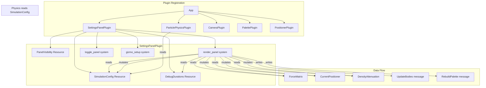
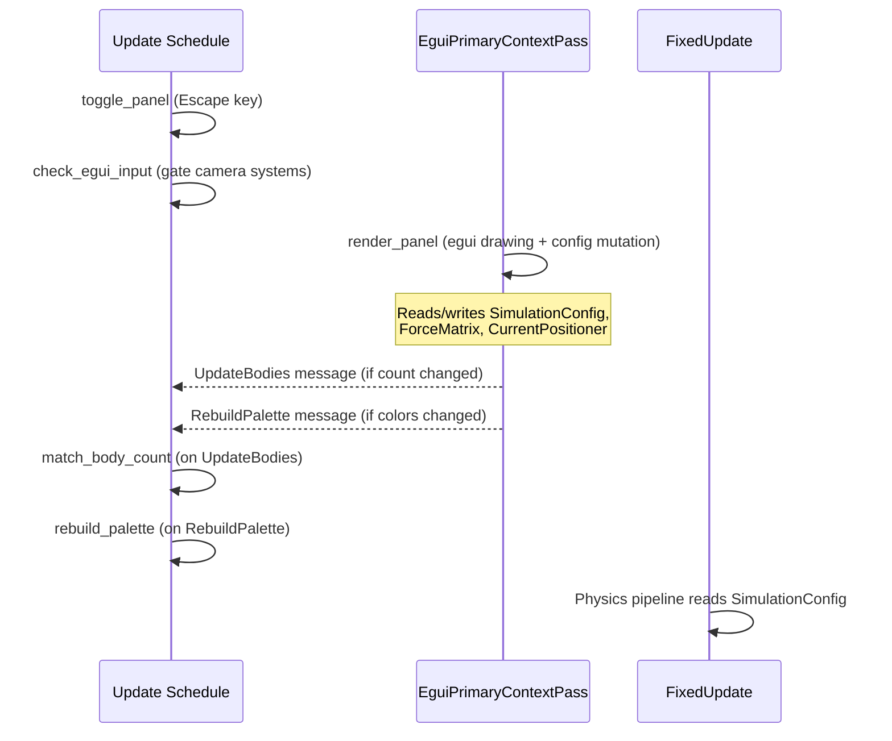
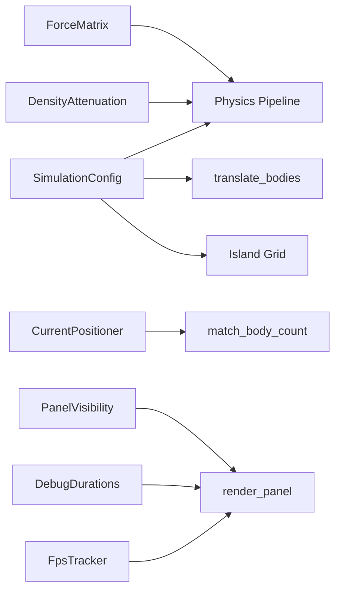
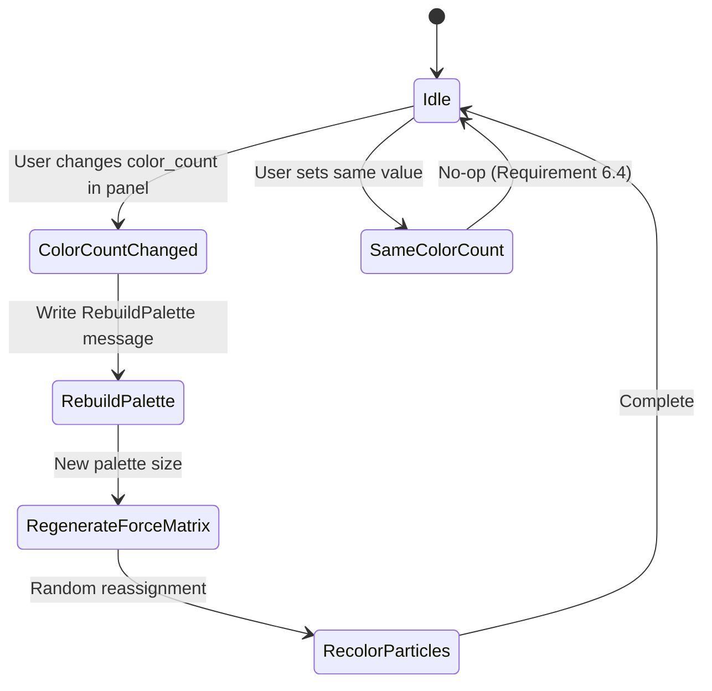

# Design Document: egui Settings Panel

## Overview

This design replaces the existing `DebugPlugin` text overlay with a comprehensive egui-based settings panel built on `bevy_egui 0.40`. The panel consolidates all debug information (FPS, force matrix, timing) and exposes compile-time constants as runtime-configurable parameters through sliders, dropdowns, and numeric inputs.

The architecture introduces a new `SettingsPanelPlugin` that owns the egui rendering, a `SimulationConfig` resource replacing scattered compile-time constants, and message-based communication for spawning/despawning particles when counts change. The existing `DebugPlugin` is fully retired — its gizmo spawning and `DebugDurations` resource insertion move to the new plugin.

### Key Design Decisions

1. **Single resource for runtime config**: A `SimulationConfig` resource replaces `config.rs` constants and module-level `const` values in `physics.rs`. Physics systems read from this resource each tick, enabling instant parameter changes without restart.

2. **Message-driven particle count changes**: Particle count adjustments use Bevy's `App::add_message` / `on_message` pattern (already established in `main.rs`) to batch spawn/despawn operations.

3. **egui multi-pass mode**: The panel system runs in `EguiPrimaryContextPass` schedule as recommended by bevy_egui 0.40 for forward compatibility.

4. **Input forwarding via bevy_egui's built-in absorption**: The `EguiContexts` resource provides `wants_pointer_input()` and `wants_keyboard_input()` methods used to conditionally gate camera systems, avoiding custom input management.

## Architecture



### System Scheduling



## Components and Interfaces

### SettingsPanelPlugin

The main plugin struct registered in `App::add_plugins`.

```rust
pub struct SettingsPanelPlugin;

impl Plugin for SettingsPanelPlugin {
    fn build(&self, app: &mut App) {
        app.add_plugins(EguiPlugin::default());
        app.init_resource::<PanelVisibility>();
        app.init_resource::<SimulationConfig>();
        app.insert_resource(DebugDurations::with_order(&["islands", "forces", "stepping"]));
        app.add_message::<RebuildPalette>();
        app.add_systems(Startup, setup_gizmos);
        app.add_systems(Update, (
            toggle_panel,
            gate_camera_input,
        ));
        app.add_systems(EguiPrimaryContextPass, render_panel);
        app.add_systems(Update, (
            handle_particle_count_change.run_if(on_message::<UpdateBodies>),
            handle_palette_rebuild.run_if(on_message::<RebuildPalette>),
        ));
    }
}
```

### PanelVisibility Resource

```rust
#[derive(Resource)]
pub struct PanelVisibility {
    pub visible: bool,
}

impl Default for PanelVisibility {
    fn default() -> Self {
        Self { visible: true }
    }
}
```

### SimulationConfig Resource

Centralizes all previously-constant parameters into a single mutable resource.

```rust
#[derive(Resource)]
pub struct SimulationConfig {
    // Particle management
    pub particle_count: usize,
    pub color_count: usize,

    // Physics constants
    pub max_dist: f64,
    pub min_rel_dist: f64,
    pub drag_halflife: f64,

    // Density attenuation parameters
    pub density_limit: f64,
    pub density_same_color: f64,
    pub density_diff_color: f64,

    // World
    pub world_scale: f64,
}

impl Default for SimulationConfig {
    fn default() -> Self {
        Self {
            particle_count: 50_000,
            color_count: 5,
            max_dist: 0.045,
            min_rel_dist: 1.0 / 3.0,
            drag_halflife: 0.043,
            density_limit: 12.0,
            density_same_color: 1.0,
            density_diff_color: 0.5,
            world_scale: 128.0,
        }
    }
}
```

### Messages

```rust
/// Triggers particle spawn/despawn to match SimulationConfig::particle_count.
#[derive(Message)]
struct UpdateBodies;

/// Triggers palette rebuild and particle recoloring for new color_count.
#[derive(Message)]
struct RebuildPalette;
```

### Key System Signatures

```rust
/// Toggle panel visibility on Escape key press.
fn toggle_panel(
    keys: Res<ButtonInput<KeyCode>>,
    mut visibility: ResMut<PanelVisibility>,
)

/// Prevent camera systems from consuming input when egui wants it.
fn gate_camera_input(
    contexts: EguiContexts,
    // Writes to a resource that camera systems check
    mut camera_input_enabled: ResMut<CameraInputEnabled>,
)

/// Main egui render system — draws the side panel and handles all UI interactions.
fn render_panel(
    mut contexts: EguiContexts,
    visibility: Res<PanelVisibility>,
    mut config: ResMut<SimulationConfig>,
    mut force_matrix: ResMut<ForceMatrix>,
    mut positioner: ResMut<CurrentPositioner>,
    mut density_attenuation: ResMut<DensityAttenuation>,
    debug_durations: Res<DebugDurations>,
    time: Res<Time>,
    mut update_bodies: MessageWriter<UpdateBodies>,
    mut rebuild_palette: MessageWriter<RebuildPalette>,
)

/// Spawn bounding-box wireframe and axis arrows (migrated from DebugPlugin).
fn setup_gizmos(
    mut commands: Commands,
    mut gizmos: ResMut<Assets<GizmoAsset>>,
    config: Res<SimulationConfig>,
)
```

### CameraInputEnabled Resource

```rust
/// Gates camera systems — when false, camera ignores mouse/keyboard.
#[derive(Resource)]
pub struct CameraInputEnabled(pub bool);

impl Default for CameraInputEnabled {
    fn default() -> Self { Self(true) }
}
```

Camera systems (`update_camera`, `pan_bodies`, `auto_orbit_camera`) add an early-return check:
```rust
if !camera_input.0 { return; }
```

### Input Gating Logic

```rust
fn gate_camera_input(
    contexts: EguiContexts,
    mut camera_input: ResMut<CameraInputEnabled>,
) {
    let ctx = contexts.ctx();
    // Pointer: only block camera when egui actively wants pointer
    let pointer_over_egui = ctx.is_pointer_over_area();
    // Keyboard: only block when a text field is focused
    let keyboard_captured = ctx.wants_keyboard_input();

    camera_input.0 = !pointer_over_egui && !keyboard_captured;
}
```

This satisfies Requirement 12.4 (pointer forwarding when egui doesn't want it) and 12.5 (keyboard forwarding when no text field is focused).

### Panel Layout Structure

```rust
fn render_panel(/* ... */) {
    if !visibility.visible { return; }

    egui::SidePanel::left("settings_panel")
        .default_width(320.0)
        .show(contexts.ctx_mut(), |ui| {
            egui::ScrollArea::vertical().show(ui, |ui| {
                // Section: Performance
                egui::CollapsingHeader::new("Performance")
                    .default_open(true)
                    .show(ui, |ui| { /* FPS, timing durations */ });

                // Section: Physics
                egui::CollapsingHeader::new("Physics")
                    .default_open(true)
                    .show(ui, |ui| { /* MAX_DIST, MIN_REL_DIST, DRAG_HALFLIFE, density params */ });

                // Section: Force Matrix
                egui::CollapsingHeader::new("Force Matrix")
                    .default_open(true)
                    .show(ui, |ui| { /* matrix type dropdown, editable grid */ });

                // Section: Simulation
                egui::CollapsingHeader::new("Simulation")
                    .default_open(true)
                    .show(ui, |ui| { /* particle count, color count, positioner */ });

                // Section: Appearance
                egui::CollapsingHeader::new("Appearance")
                    .default_open(true)
                    .show(ui, |ui| { /* world scale */ });
            });
        });
}
```

### FPS Tracking

A lightweight FPS tracker integrated into the panel (replacing `FpsOverlayPlugin`):

```rust
#[derive(Resource)]
struct FpsTracker {
    frame_count: u32,
    elapsed: f32,
    current_fps: f32,
}
```

Updated every frame, but the displayed value only refreshes every 100ms (matching Requirement 3.1).

### Island Grid Rebuild on MAX_DIST Change

When `max_dist` changes, the island grid dimensions change (`side = max_dist.recip().floor() as usize`). The design introduces a system that detects `SimulationConfig` changes and rebuilds island resources:

```rust
fn rebuild_islands_if_needed(
    config: Res<SimulationConfig>,
    mut islands: ResMut<Islands>,
    mut neighbor_ixs: ResMut<IslandNeighborIxs>,
    mut neighborhoods: ResMut<IslandNeighborhoods>,
    mut grid: ResMut<IslandGrid>,
) {
    if !config.is_changed() { return; }
    let new_side = config.max_dist.recip().floor() as usize;
    if new_side == grid.side { return; }
    // Rebuild grid, islands, neighbor indices, neighborhoods
}
```

### Gizmo Update on World Scale Change

The bounding-box gizmo must reflect the current `world_scale`. Rather than recreating assets each frame, the design stores the gizmo entity and replaces the `GizmoAsset` handle when scale changes:

```rust
fn update_gizmo_scale(
    config: Res<SimulationConfig>,
    mut gizmos: ResMut<Assets<GizmoAsset>>,
    gizmo_entity: Single<&mut Gizmo, With<BoundingBoxGizmo>>,
) {
    if !config.is_changed() { return; }
    // Rebuild gizmo asset with new scale
}
```

## Data Models

### SimulationConfig Constraints

| Field | Type | Min | Max | Step | Default |
|-------|------|-----|-----|------|---------|
| particle_count | usize | 100 | 500,000 | 100 | 50,000 |
| color_count | usize | 1 | 9 | 1 | 5 |
| max_dist | f64 | 0.01 | 0.2 | 0.005 | 0.045 |
| min_rel_dist | f64 | 0.05 | 0.95 | 0.05 | 0.333 |
| drag_halflife | f64 | 0.001 | 0.5 | 0.01 | 0.043 |
| density_limit | f64 | 1.0 | 50.0 | 1.0 | 12.0 |
| density_same_color | f64 | 0.0 | 5.0 | 0.25 | 1.0 |
| density_diff_color | f64 | 0.0 | 5.0 | 0.25 | 0.5 |
| world_scale | f64 | 16.0 | 512.0 | 1.0 | 128.0 |

### ForceMatrix Cell Constraints

| Property | Value |
|----------|-------|
| Min cell value | -1.0 |
| Max cell value | 1.0 |
| Display precision | 3 decimal places |
| Dimensions | color_count × color_count |

### Resource Dependency Graph



### State Transitions for Color Count Change




## Correctness Properties

*A property is a characteristic or behavior that should hold true across all valid executions of a system — essentially, a formal statement about what the system should do. Properties serve as the bridge between human-readable specifications and machine-verifiable correctness guarantees.*

### Property 1: Configuration clamping invariant

*For any* SimulationConfig field and *for any* arbitrary numeric input value (including values outside the valid range, negative values, zero, and extreme values), the clamping function SHALL produce a result that falls within the field's defined valid range:
- particle_count: [100, 500_000]
- color_count: [1, 9]
- max_dist: [0.01, 0.2]
- min_rel_dist: [0.05, 0.95]
- drag_halflife: [0.001, 0.5]
- density_limit: [1.0, 50.0]
- density_same_color: [0.0, 5.0]
- density_diff_color: [0.0, 5.0]
- world_scale: [16.0, 512.0]

**Validates: Requirements 5.3, 5.4, 6.3, 7.3, 7.4, 7.5, 7.7, 7.8, 7.9, 8.3, 10.3**

### Property 2: Force matrix dimension invariant

*For any* valid color_count in [1, 9] and *for any* ForceMatrixType variant, calling `ForceMatrix::new(color_count, matrix_type)` SHALL produce a matrix with exactly `color_count * color_count` data elements, and all cell values SHALL be in the range [-1.0, 1.0].

**Validates: Requirements 9.2, 10.3**

### Property 3: Force matrix display completeness

*For any* ForceMatrix instance with arbitrary cell values in [-1.0, 1.0], the formatted display string SHALL contain the matrix type name, the color count, and exactly `color_count * color_count` numeric values each formatted to 3 decimal places.

**Validates: Requirements 3.2, 10.4**

### Property 4: Rolling average correctness

*For any* sequence of Duration values added to an AvgDuration tracker, the reported average SHALL equal the arithmetic mean of the most recent min(n, 64) samples (where n is the total number of samples added), expressed in milliseconds to 3 decimal places.

**Validates: Requirements 3.4**

### Property 5: Input gating correctness

*For any* combination of (pointer_over_egui: bool, wants_keyboard_input: bool) states reported by the egui context, the CameraInputEnabled resource SHALL be set to `true` if and only if `pointer_over_egui` is false AND `wants_keyboard_input` is false. When CameraInputEnabled is true, pointer and keyboard events SHALL reach camera systems.

**Validates: Requirements 12.4, 12.5**

## Error Handling

### Invalid User Input

| Scenario | Handling |
|----------|----------|
| Particle count outside [100, 500_000] | Clamp to nearest bound, display clamped value |
| Color count outside [1, 9] | Clamp to nearest bound |
| Physics slider outside valid range | Clamp to nearest bound (egui sliders enforce this natively) |
| Force matrix cell outside [-1.0, 1.0] | Clamp to -1.0 or 1.0 |
| Non-numeric text in numeric field | egui's DragValue rejects non-numeric input; field retains previous value |
| World scale outside [16.0, 512.0] | Clamp to nearest bound |

### Resource Access Errors

| Scenario | Handling |
|----------|----------|
| EguiContexts unavailable (no window) | `render_panel` system uses `Result` return type; returns `Ok(())` early if context unavailable |
| ForceMatrix index out of bounds | Existing `Index` impl returns `&0.0` for OOB access (no panic) |
| Empty body query during despawn | Loop terminates naturally when `current_size <= target` |
| Island grid rebuild with 0 max_dist | Prevented by clamping max_dist minimum to 0.01 (grid side ≤ 100) |

### Edge Cases

- **particle_count = 100 (minimum)**: System despawns down to 100 particles via random selection. Surviving particles retain all state.
- **color_count = 1**: Force matrix is 1×1. All particles share one color. Palette has single hue (0°).
- **max_dist change triggers island rebuild**: Mid-simulation grid resize clears all island assignments; next tick's `assign_islands` repopulates from current positions. Brief one-frame delay is acceptable.
- **world_scale = 16.0 (minimum)**: All particles rendered in a 16×16×16 cube. Gizmo shrinks correspondingly. Camera orbit distance unchanged — user may need to zoom in.

## Testing Strategy

### Property-Based Testing

This feature contains testable pure-function logic (clamping, formatting, averaging, matrix generation) suitable for property-based testing.

**Library:** [proptest](https://crates.io/crates/proptest) — the standard PBT library for Rust.

**Configuration:**
- Minimum 100 test cases per property
- Each test tagged with: `// Feature: egui-settings-panel, Property {N}: {description}`

**Property tests to implement:**

1. **Config clamping** — Generate random numeric values across the full f64/usize range, apply each field's clamp function, assert result within valid bounds.
2. **Force matrix dimensions** — Generate (color_count ∈ 1..=9, random ForceMatrixType), construct matrix, assert data.len() == color_count².
3. **Force matrix display** — Generate random matrices, format to string, parse and verify structure.
4. **Rolling average** — Generate random Duration sequences (1..=128 items), verify average matches expected.
5. **Input gating** — Generate random boolean pairs, verify output matches logical formula.

### Unit Tests (Example-Based)

- Panel toggle: pressing Escape flips visibility
- Default resource values match requirements
- Color count no-op: same value triggers no rebuild message
- Positioner selection updates resource without repositioning
- FPS tracker only refreshes display at 100ms intervals
- All 7 ForceMatrixType variants listed in dropdown
- All 10 PositionerType variants listed in dropdown

### Integration Tests

- Particle count change: set config to 1000, fire UpdateBodies, verify entity count converges
- Color count change: set to 3, fire RebuildPalette, verify palette.size() == 3, force_matrix dimensions == 9, all particle colors ∈ [0, 2]
- Physics reads config: modify max_dist in config, verify physics pipeline uses new value
- World scale change: modify scale, verify translate() output uses new scale
- Island grid rebuild: change max_dist from 0.045 to 0.1, verify grid.side changes from 22 to 10

### Test File Organization

```
tests/
├── property_tests/
│   ├── config_clamping.rs
│   ├── force_matrix.rs
│   ├── rolling_average.rs
│   └── input_gating.rs
└── integration/
    ├── panel_visibility.rs
    ├── particle_count.rs
    ├── color_count.rs
    └── physics_config.rs
```
