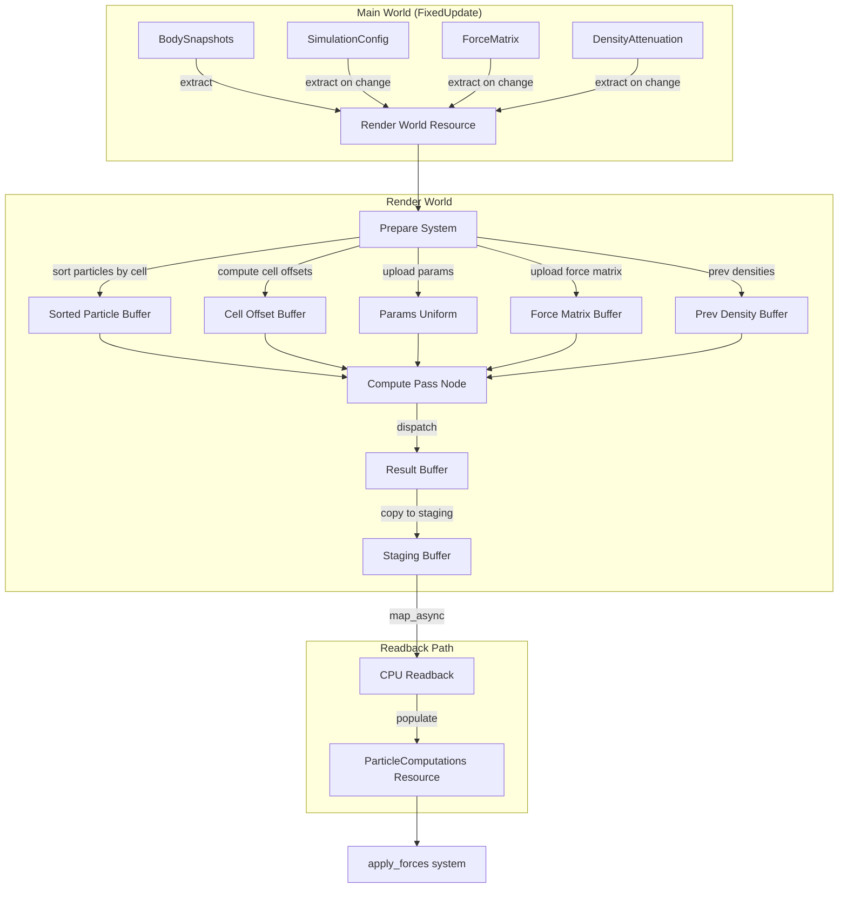
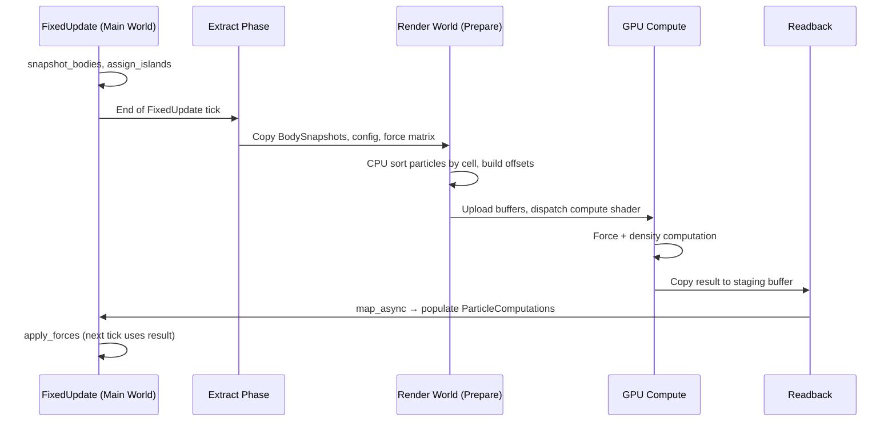

# Design Document: GPU Force Compute

## Overview

This design moves the pairwise force computation from CPU (Rayon `par_iter` over a spatial island grid) to a GPU compute shader dispatched via Bevy's render graph. The GPU pipeline handles:

1. **Uploading** particle positions/colors and simulation parameters to GPU storage buffers each physics tick
2. **Sorting** particles by spatial grid cell (counting sort with prefix sum) so the compute shader can perform neighbor lookups without O(n²) all-pairs
3. **Dispatching** a WGSL compute shader that evaluates the piecewise force function and density accumulation per particle
4. **Reading back** per-particle force vectors and density values to CPU memory for the existing `apply_forces` system

The rest of the physics pipeline (velocity integration, position wrapping, island assignment for rendering) remains on the CPU. A runtime backend selector allows switching between GPU and CPU paths without pausing the simulation.

### Design Rationale

- **Counting sort over radix sort**: The grid cell count is small (≤ 10,648 at default settings, capped at 1M). A two-pass counting sort (histogram + prefix sum + scatter) is simpler than a full radix sort and sufficient for the bounded key space.
- **Single dispatch per tick**: Unlike multi-pass approaches, we perform spatial sort on the CPU (cheap for the histogram/prefix-sum at ≤500k particles) and upload the already-sorted buffer. This avoids multi-dispatch synchronization complexity on GPU.
- **Readback via map_async**: Bevy's wgpu backend supports asynchronous buffer mapping. We use a staging buffer with `MAP_READ` usage and poll completion, allowing CPU work to proceed while waiting.

## Architecture



### System Scheduling



**Key timing**: The GPU result from tick N is consumed by `apply_forces` in tick N+1 (one-tick latency). This avoids blocking FixedUpdate on GPU completion. If the readback is not ready, the CPU fallback runs for that tick.

## Components and Interfaces

### New Modules

```
src/physics/
├── gpu/
│   ├── mod.rs              # GpuForcePlugin, public re-exports
│   ├── pipeline.rs         # ComputePipeline setup, bind group layouts
│   ├── buffers.rs          # Buffer allocation, upload, readback logic
│   ├── extract.rs          # Extract systems (main world → render world)
│   ├── node.rs             # Render graph compute pass node
│   ├── sort.rs             # CPU-side counting sort for spatial partitioning
│   └── shader.wgsl         # The WGSL compute shader
├── backend.rs              # ForceBackend resource, switching logic
```

### Key Resources

```rust
/// Selects GPU or CPU force computation backend.
#[derive(Resource, Clone, Copy, PartialEq, Eq)]
pub enum ForceBackend {
    Gpu,
    Cpu,
}

/// Render-world resource holding extracted particle data.
#[derive(Resource)]
pub struct GpuParticleData {
    /// Sorted particle positions (f32×3) + color (u32), contiguous.
    pub sorted_particles: Vec<u8>,
    /// Cell offset array: start index per cell.
    pub cell_offsets: Vec<u32>,
    /// Number of active particles.
    pub particle_count: u32,
    /// Grid side length.
    pub grid_side: u32,
}

/// Render-world resource holding simulation parameters for the GPU.
#[derive(Resource)]
pub struct GpuSimParams {
    pub max_dist: f32,
    pub min_rel_dist: f32,
    pub max_dist_sqrd: f32,
    pub max_dist_recip: f32,
    pub min_dist_recip: f32,
    pub inv_min_dist_recip: f32,
    pub density_limit: f32,
    pub density_same_color: f32,
    pub density_diff_color: f32,
    pub attenuation_enabled: u32,
    pub particle_count: u32,
    pub grid_side: u32,
    pub color_count: u32,
    pub _padding: u32,
}

/// Render-world resource for previous-tick density values.
#[derive(Resource, Default)]
pub struct GpuPrevDensities(pub Vec<f32>);

/// Handle to GPU buffer resources managed in the render world.
#[derive(Resource)]
pub struct GpuForceBuffers {
    pub particle_buffer: Buffer,
    pub cell_offset_buffer: Buffer,
    pub params_buffer: Buffer,
    pub force_matrix_buffer: Buffer,
    pub prev_density_buffer: Buffer,
    pub result_buffer: Buffer,
    pub staging_buffer: Buffer,
    /// Current capacity in particles (for reallocation detection).
    pub capacity: u32,
}
```

### Plugin Structure

```rust
pub struct GpuForcePlugin;

impl Plugin for GpuForcePlugin {
    fn build(&self, app: &mut App) {
        app.init_resource::<ForceBackend>();
        // Register extract systems
        // Register render-world prepare system
        // Register render graph node
    }
}
```

The `GpuForcePlugin` integrates with `ParticlePhysicsPlugin`. The existing `compute_forces` system checks `ForceBackend` and either runs the Rayon path or reads from `ParticleComputations` populated by GPU readback.

## Data Models

### GPU Buffer Layouts

#### Particle Buffer (Storage, read-only in shader)

Per-particle stride: 16 bytes (aligned to 16 for vec4 packing)

| Offset | Field | Type | Notes |
|--------|-------|------|-------|
| 0 | position.x | f32 | Wrapped to [0, 1) |
| 4 | position.y | f32 | Wrapped to [0, 1) |
| 8 | position.z | f32 | Wrapped to [0, 1) |
| 12 | color_index | u32 | 0..color_count-1 |

Total size: `particle_count × 16` bytes. Max: 500,000 × 16 = 8 MB.

#### Cell Offset Buffer (Storage, read-only in shader)

Array of `u32` with length = `grid_side³ + 1`. Entry `i` stores the starting index of cell `i` in the sorted particle buffer. Entry `grid_side³` stores total particle count (sentinel).

Max size: (100³ + 1) × 4 = ~4 MB (at grid_side=100 clamp). Typical: (22³ + 1) × 4 = ~42 KB.

#### Params Buffer (Uniform)

```wgsl
struct Params {
    max_dist: f32,
    min_rel_dist: f32,
    max_dist_sqrd: f32,
    max_dist_recip: f32,
    min_dist_recip: f32,
    inv_min_dist_recip: f32,
    density_limit: f32,
    density_same_color: f32,
    density_diff_color: f32,
    attenuation_enabled: u32,
    particle_count: u32,
    grid_side: u32,
    color_count: u32,
    _padding: u32,
};
```

Size: 56 bytes (14 × 4), padded to 64 bytes for uniform alignment.

#### Force Matrix Buffer (Storage, read-only)

Flat array of `f32` with length = `color_count²`. Max: 81 × 4 = 324 bytes.

Indexing: `force_matrix[source_color * color_count + neighbor_color]`

#### Previous Density Buffer (Storage, read-only)

Array of `f32` with length = `particle_count`. Contains per-particle density from the previous tick's result buffer. Initialized to 0.0 on first tick or when attenuation is re-enabled.

Max size: 500,000 × 4 = 2 MB.

#### Result Buffer (Storage, write in shader, read for copy)

Per-particle stride: 16 bytes

| Offset | Field | Type |
|--------|-------|------|
| 0 | force.x | f32 |
| 4 | force.y | f32 |
| 8 | force.z | f32 |
| 12 | density | f32 |

Total size: `particle_count × 16` bytes. Max: 8 MB.

#### Staging Buffer (MAP_READ + COPY_DST)

Same size as Result Buffer. Used for async CPU readback via `map_async`.

### Bind Group Layout

```
@group(0) @binding(0) var<storage, read> particles: array<Particle>;
@group(0) @binding(1) var<storage, read> cell_offsets: array<u32>;
@group(0) @binding(2) var<uniform> params: Params;
@group(0) @binding(3) var<storage, read> force_matrix: array<f32>;
@group(0) @binding(4) var<storage, read> prev_densities: array<f32>;
@group(0) @binding(5) var<storage, read_write> results: array<Result>;
```

## Compute Shader Algorithm (WGSL)

```wgsl
struct Particle {
    pos: vec3<f32>,
    color: u32,
};

struct Result {
    force: vec3<f32>,
    density: f32,
};

struct Params {
    max_dist: f32,
    min_rel_dist: f32,
    max_dist_sqrd: f32,
    max_dist_recip: f32,
    min_dist_recip: f32,
    inv_min_dist_recip: f32,
    density_limit: f32,
    density_same_color: f32,
    density_diff_color: f32,
    attenuation_enabled: u32,
    particle_count: u32,
    grid_side: u32,
    color_count: u32,
    _padding: u32,
};

@group(0) @binding(0) var<storage, read> particles: array<Particle>;
@group(0) @binding(1) var<storage, read> cell_offsets: array<u32>;
@group(0) @binding(2) var<uniform> params: Params;
@group(0) @binding(3) var<storage, read> force_matrix: array<f32>;
@group(0) @binding(4) var<storage, read> prev_densities: array<f32>;
@group(0) @binding(5) var<storage, read_write> results: array<Result>;

@compute @workgroup_size(256)
fn main(@builtin(global_invocation_id) global_id: vec3<u32>) {
    let idx = global_id.x;
    if (idx >= params.particle_count) {
        return;
    }

    let body0 = particles[idx];
    let source_color = body0.color;

    // Compute density factor from previous tick
    var density_factor: f32 = 1.0;
    if (params.attenuation_enabled == 1u) {
        let prev_density = prev_densities[idx];
        density_factor = 1.0 - clamp(prev_density - params.density_limit, 0.0, 1.0);
    }

    // Determine which grid cell this particle belongs to
    let side_f = f32(params.grid_side);
    let cell_x = u32(clamp(body0.pos.x * side_f, 0.0, side_f - 1.0));
    let cell_y = u32(clamp(body0.pos.y * side_f, 0.0, side_f - 1.0));
    let cell_z = u32(clamp(body0.pos.z * side_f, 0.0, side_f - 1.0));

    var total_force = vec3<f32>(0.0, 0.0, 0.0);
    var total_density: f32 = 0.0;
    let side = params.grid_side;

    // Iterate over 3×3×3 neighboring cells
    for (var dz: i32 = -1; dz <= 1; dz++) {
        for (var dy: i32 = -1; dy <= 1; dy++) {
            for (var dx: i32 = -1; dx <= 1; dx++) {
                // Toroidal wrapping on cell coordinates
                let nx = u32((i32(cell_x) + dx + i32(side)) % i32(side));
                let ny = u32((i32(cell_y) + dy + i32(side)) % i32(side));
                let nz = u32((i32(cell_z) + dz + i32(side)) % i32(side));
                let cell_idx = nx + ny * side + nz * side * side;

                // Range of particles in this cell
                let start = cell_offsets[cell_idx];
                let end = cell_offsets[cell_idx + 1u];

                for (var j: u32 = start; j < end; j++) {
                    if (j == idx) { continue; }  // skip self

                    let body1 = particles[j];

                    // Toroidal shortest-path distance
                    var min_pos = body1.pos - body0.pos + vec3<f32>(0.5);
                    min_pos = fract(min_pos) - vec3<f32>(0.5);
                    // Note: fract(x) = x - floor(x), equivalent to rem_euclid for [0,1) inputs + 0.5

                    let dist_sqrd = dot(min_pos, min_pos);

                    // Early exits
                    if (dist_sqrd > params.max_dist_sqrd || dist_sqrd < 1e-30) {
                        continue;
                    }

                    let dist = sqrt(dist_sqrd);
                    let rel_dist = dist * params.max_dist_recip;
                    let dir = min_pos / dist;

                    var force_scalar: f32;

                    if (rel_dist <= params.min_rel_dist) {
                        // Repulsion zone
                        force_scalar = rel_dist * params.min_dist_recip - 1.0;
                    } else {
                        // Attraction/repulsion zone based on force matrix
                        let neighbor_color = body1.color;
                        let matrix_val = force_matrix[source_color * params.color_count + neighbor_color];

                        if (matrix_val == 0.0) {
                            // Skip: zero force contribution, but still need density
                            // Actually per requirement 2.5: skip entirely (zero force AND zero density)
                            continue;
                        }

                        var f = matrix_val;
                        if (f > 0.0) {
                            f = f * density_factor;
                        }
                        force_scalar = f * (1.0 - (1.0 + params.min_rel_dist - 2.0 * rel_dist) * params.inv_min_dist_recip);
                    }

                    total_force += dir * (force_scalar * params.max_dist);

                    // Density accumulation
                    let weight = select(params.density_diff_color, params.density_same_color, source_color == body1.color);
                    total_density += weight * (1.0 - rel_dist);
                }
            }
        }
    }

    results[idx] = Result(total_force, total_density);
}
```

### Workgroup Configuration

- Workgroup size: 256 threads (1D)
- Dispatch: `ceil(particle_count / 256)` workgroups
- At 500k particles: 1,954 workgroups — well within device limits

## Spatial Partitioning Strategy

### CPU-Side Counting Sort

Rather than implementing a multi-pass GPU sort, we perform the spatial sort on the CPU during the Prepare phase. This is justified because:

1. The sort is O(n) via counting sort (bounded key space: grid_side³ ≤ 1M cells)
2. At 500k particles, the CPU sort takes ~2-3ms (single-threaded) or <1ms (Rayon parallel histogram)
3. It avoids 3-4 additional GPU dispatches and synchronization barriers
4. The sorted data is uploaded as part of the regular buffer upload

### Algorithm

```rust
fn sort_particles_by_cell(
    snapshots: &[BodySnapshot],
    grid_side: usize,
) -> (Vec<u8>, Vec<u32>) {
    let cell_count = grid_side * grid_side * grid_side;
    
    // Pass 1: Histogram - count particles per cell
    let mut counts = vec![0u32; cell_count];
    let cell_indices: Vec<usize> = snapshots.iter().map(|body| {
        let x = (body.position.x * grid_side as f64).clamp(0.0, (grid_side - 1) as f64) as usize;
        let y = (body.position.y * grid_side as f64).clamp(0.0, (grid_side - 1) as f64) as usize;
        let z = (body.position.z * grid_side as f64).clamp(0.0, (grid_side - 1) as f64) as usize;
        let cell = x + y * grid_side + z * grid_side * grid_side;
        counts[cell] += 1;
        cell
    }).collect();
    
    // Pass 2: Prefix sum → cell_offsets
    let mut cell_offsets = vec![0u32; cell_count + 1];
    for i in 0..cell_count {
        cell_offsets[i + 1] = cell_offsets[i] + counts[i];
    }
    
    // Pass 3: Scatter into sorted order
    let mut write_pos = cell_offsets[..cell_count].to_vec();
    let mut sorted_buffer = vec![0u8; snapshots.len() * 16];
    
    for (i, &cell) in cell_indices.iter().enumerate() {
        let dst = write_pos[cell] as usize;
        write_pos[cell] += 1;
        
        let body = &snapshots[i];
        let offset = dst * 16;
        // Write position as f32×3 + color as u32
        sorted_buffer[offset..offset+4].copy_from_slice(&(body.position.x as f32).to_le_bytes());
        sorted_buffer[offset+4..offset+8].copy_from_slice(&(body.position.y as f32).to_le_bytes());
        sorted_buffer[offset+8..offset+12].copy_from_slice(&(body.position.z as f32).to_le_bytes());
        sorted_buffer[offset+12..offset+16].copy_from_slice(&(body.color as u32).to_le_bytes());
    }
    
    (sorted_buffer, cell_offsets)
}
```

### Particle Index Mapping

Since particles are reordered by the sort, the result buffer indices no longer correspond to the original `BodySnapshots` ordering. We maintain a **reverse index map** (`sorted_index → original_index`) built during the scatter pass:

```rust
let mut original_indices = vec![0u32; snapshots.len()];
// During scatter:
original_indices[dst] = i as u32;
```

On readback, we use this map to write results back into `ParticleComputations` in the correct order.

### Previous Density Mapping

The `prev_densities` buffer must also be in **sorted order** for the current tick. During the prepare phase, we remap previous densities using the current sort order:

```rust
let sorted_prev_densities: Vec<f32> = (0..particle_count)
    .map(|sorted_idx| {
        let original_idx = original_indices[sorted_idx] as usize;
        prev_densities_cpu.get(original_idx).copied().unwrap_or(0.0)
    })
    .collect();
```

## Data Flow: Main World ↔ Render World ↔ GPU

### Extract Phase

Using Bevy's `ExtractResourcePlugin` pattern:

```rust
fn extract_particle_data(
    mut commands: Commands,
    snapshots: Extract<Res<BodySnapshots>>,
    config: Extract<Res<SimulationConfig>>,
    force_matrix: Extract<Res<ForceMatrix>>,
    attenuation: Extract<Res<DensityAttenuation>>,
    backend: Extract<Res<ForceBackend>>,
) {
    if *backend != ForceBackend::Gpu { return; }
    
    // Clone snapshots into render world
    commands.insert_resource(ExtractedSnapshots(snapshots.0.clone()));
    // Extract config/matrix only if changed (tracked via a generation counter)
    commands.insert_resource(ExtractedConfig::from(&*config));
    commands.insert_resource(ExtractedForceMatrix(force_matrix.data.clone(), force_matrix.color_count));
    commands.insert_resource(ExtractedAttenuation(attenuation.0));
}
```

### Prepare Phase

In the render world's Prepare schedule:
1. Sort particles by cell (CPU counting sort)
2. Build cell_offsets array
3. Remap previous densities to sorted order
4. Upload all buffers to GPU via `RenderQueue::write_buffer`

### Readback Flow

```rust
fn readback_results(
    staging_buffer: &Buffer,
    device: &RenderDevice,
    original_indices: &[u32],
    particle_count: usize,
) -> Option<Vec<ParticleComputation>> {
    let slice = staging_buffer.slice(..);
    
    // Map buffer asynchronously
    let (tx, rx) = crossbeam_channel::bounded(1);
    slice.map_async(MapMode::Read, move |result| {
        tx.send(result).ok();
    });
    
    device.poll(Maintain::Wait); // or poll with timeout
    
    match rx.try_recv() {
        Ok(Ok(())) => {
            let data = slice.get_mapped_range();
            let results: &[GpuResult] = bytemuck::cast_slice(&data);
            
            let mut computations = vec![ParticleComputation::default(); particle_count];
            for (sorted_idx, result) in results.iter().enumerate() {
                let original_idx = original_indices[sorted_idx] as usize;
                computations[original_idx] = ParticleComputation {
                    force: DVec3::new(
                        result.force_x as f64,
                        result.force_y as f64,
                        result.force_z as f64,
                    ),
                    density: result.density as f64,
                };
            }
            
            drop(data);
            staging_buffer.unmap();
            Some(computations)
        }
        _ => None, // Readback not ready or failed
    }
}
```

## Readback Synchronization Strategy

### One-Tick Latency Model

The GPU compute result from physics tick N becomes available for `apply_forces` in tick N+1. This eliminates CPU stalls:

```
Tick N:   [extract] → [prepare + upload] → [dispatch] → [copy to staging]
Tick N+1: [map_async check] → [populate ParticleComputations] → [apply_forces uses it]
```

### Fallback on Readback Failure

If `map_async` has not completed by the time `compute_forces` runs (checked via `try_recv` on the channel):
1. Clear the GPU-provided computations
2. Run the CPU Rayon path for that tick
3. Log a warning (once per transition, not per tick)

### Double-Buffered Staging

To avoid waiting for the previous frame's map to complete before issuing a new copy:

```rust
pub struct GpuForceBuffers {
    // ...
    pub staging_buffers: [Buffer; 2],
    pub active_staging: usize, // alternates 0/1 each tick
}
```

Each tick writes to `staging_buffers[active_staging]` and reads from `staging_buffers[1 - active_staging]`.

## Runtime Backend Switching

### ForceBackend Resource

```rust
#[derive(Resource, Clone, Copy, PartialEq, Eq, Default)]
pub enum ForceBackend {
    #[default]
    Gpu,
    Cpu,
}
```

Default is `Gpu` when the wgpu adapter reports compute shader support. Falls back to `Cpu` otherwise.

### Switching Logic

The `compute_forces` system is modified:

```rust
fn compute_forces(
    backend: Res<ForceBackend>,
    gpu_computations: Option<Res<GpuComputations>>,
    // ... existing params for CPU path ...
) {
    match *backend {
        ForceBackend::Gpu => {
            if let Some(gpu) = gpu_computations {
                if gpu.is_ready() {
                    // Use GPU results
                    computations.0 = gpu.take();
                    return;
                }
            }
            // Fallback: GPU result not ready, run CPU
            run_cpu_forces(/* ... */);
        }
        ForceBackend::Cpu => {
            run_cpu_forces(/* ... */);
        }
    }
}
```

### Transition Behavior

- **GPU → CPU**: Immediate. Next tick skips extract/prepare/dispatch. GPU buffers remain allocated but idle (deallocated after N idle ticks to reclaim VRAM).
- **CPU → GPU**: Immediate. Next tick performs extract + full buffer allocation + dispatch. First result available tick N+2 (due to one-tick latency). Tick N+1 uses CPU fallback.

### GPU Availability Detection

```rust
fn detect_gpu_compute_support(
    render_device: Res<RenderDevice>,
    mut backend: ResMut<ForceBackend>,
) {
    // Check wgpu adapter features
    let features = render_device.features();
    if !features.contains(wgpu::Features::STORAGE_RESOURCE_BINDING_ARRAY) {
        // Basic storage buffers are always available in wgpu,
        // but we check device limits for workgroup size, buffer size, etc.
    }
    
    let limits = render_device.limits();
    if limits.max_storage_buffer_binding_size < 8_000_000 {
        // Can't fit 500k particles
        *backend = ForceBackend::Cpu;
    }
}
```

## Error Handling

### Buffer Creation Failure

If `RenderDevice::create_buffer` returns an error (e.g., out of VRAM):
- Log error with context (requested size, operation)
- Set `ForceBackend` to `Cpu`
- Mark GPU pipeline as disabled (skip all GPU systems)
- Display "GPU unavailable: insufficient VRAM" in settings panel

### Shader Compilation Failure

If `PipelineCache` reports the compute pipeline failed to compile:
- Log the shader compilation error
- Set `ForceBackend` to `Cpu`
- Display "GPU unavailable: shader error" in settings panel

### Device Lost

If the wgpu device is lost (GPU reset, driver crash):
- The `map_async` callback receives an error
- Set `ForceBackend` to `Cpu`
- Attempt to reinitialize GPU pipeline after a cooldown (e.g., 60 frames)
- Log the device loss event

### Readback Timeout

If readback does not complete within 16ms:
- Discard the partial result
- Run CPU fallback for that tick
- Increment a counter; if 3 consecutive timeouts occur, switch to CPU permanently with a warning

### Particle Count Exceeds Maximum

If particle count > 500,000 at upload time:
- Clamp upload to 500,000 particles
- Log a warning that excess particles are skipped on GPU
- The CPU path still handles all particles if backend is switched

## Correctness Properties

*A property is a characteristic or behavior that should hold true across all valid executions of a system—essentially, a formal statement about what the system should do. Properties serve as the bridge between human-readable specifications and machine-verifiable correctness guarantees.*

### Property 1: Data Conversion Round-Trip

*For any* valid particle position (DVec3 with components in [0.0, 1.0)) and color index (usize in [0, 9)), converting to GPU buffer format (f32×3 + u32) and then reading back should produce values within f32 epsilon of the original. Similarly, for any valid SimulationConfig f64 parameter, converting to f32 and widening back to f64 should yield a value within f32 epsilon of the original.

**Validates: Requirements 1.1, 1.2, 1.3, 4.2**

### Property 2: Counting Sort Partitioning Invariant

*For any* set of particles with positions in [0.0, 1.0)³ and a given grid_side, after performing the counting sort: (a) cell_offsets has length grid_side³ + 1, (b) cell_offsets is non-decreasing with cell_offsets[last] = particle_count, (c) every particle in the range [cell_offsets[i], cell_offsets[i+1]) has a position that maps to cell index i, and (d) the total number of particles across all cells equals the input count.

**Validates: Requirements 3.1, 3.3**

### Property 3: Grid Dimension Calculation

*For any* max_dist in [0.01, 0.2], the computed grid_side should equal floor(1.0 / max_dist) when floor(1.0 / max_dist) ≤ 100, and should be clamped to 100 otherwise. The total cell count should equal grid_side³.

**Validates: Requirements 3.4, 3.6**

### Property 4: Toroidal Cell Neighbor Wrapping

*For any* cell coordinate (x, y, z) in a grid of side S, the 27 neighbor cell indices (computed via (coord + offset).rem_euclid(S) for offsets in {-1, 0, 1}³) should all be valid indices in [0, S³), and boundary cells (where any coordinate is 0 or S-1) should have neighbors that wrap to the opposite edge.

**Validates: Requirements 3.2**

### Property 5: Piecewise Force Function Correctness

*For any* two particles (body0, body1) with valid positions in [0.0, 1.0)³, colors in [0, color_count), a force matrix with values in [-1.0, 1.0], and valid physics parameters: the computed force vector and density contribution should match the piecewise formula — returning zero when dist² > max_dist² or dist² < 1e-30, applying (rel_dist / min_rel_dist - 1.0) in the repulsion zone, applying matrix_val * (1.0 - (1.0 + min_rel_dist - 2.0 * rel_dist) / (1.0 - min_rel_dist)) in the attraction zone, and accumulating density as weight * (1.0 - rel_dist) with correct same/diff color weight selection.

**Validates: Requirements 2.1, 2.2, 2.3, 2.4, 2.5, 2.6, 2.7, 5.6**

### Property 6: Density Attenuation Selectivity

*For any* force matrix value and any previous density value, when attenuation is enabled: (a) positive matrix values are multiplied by density_factor = 1.0 - clamp(prev_density - density_limit, 0.0, 1.0), and (b) negative or zero matrix values are never modified by the density factor. When attenuation is disabled, all matrix values use density_factor = 1.0.

**Validates: Requirements 2.9, 2.10, 5.3, 9.2, 9.3**

### Property 7: GPU-CPU Behavioral Parity

*For any* set of particles (up to 1000 for test feasibility) with valid positions, colors, force matrix, simulation parameters, and previous densities, the GPU force algorithm (implemented as a pure Rust reference matching the WGSL shader logic using f32 arithmetic) should produce per-particle force and density values that match the CPU `get_computation` function output within 1e-3 absolute tolerance per component.

**Validates: Requirements 2.11, 5.1, 5.2, 5.5, 9.6**

## Testing Strategy

### Property-Based Tests (proptest, min 100 iterations each)

Each correctness property above maps to a proptest test:

- **Property 1**: Generate random `Vec<BodySnapshot>` (positions uniform in [0,1), colors in [0,9)). Serialize to buffer bytes, deserialize, compare within f32 epsilon.
  - Tag: `Feature: gpu-force-compute, Property 1: Data Conversion Round-Trip`

- **Property 2**: Generate random particle positions (100-5000 particles), random grid_side (5-30). Run counting sort, verify all invariants.
  - Tag: `Feature: gpu-force-compute, Property 2: Counting Sort Partitioning Invariant`

- **Property 3**: Generate random max_dist in [0.01, 0.2]. Compute grid_side, verify formula.
  - Tag: `Feature: gpu-force-compute, Property 3: Grid Dimension Calculation`

- **Property 4**: Generate random cell coordinate and grid_side (2-50). Compute all 27 neighbors, verify bounds and wrapping.
  - Tag: `Feature: gpu-force-compute, Property 4: Toroidal Cell Neighbor Wrapping`

- **Property 5**: Generate random particle pairs, random force matrix, random physics params. Run force function, verify output matches formula.
  - Tag: `Feature: gpu-force-compute, Property 5: Piecewise Force Function Correctness`

- **Property 6**: Generate random (matrix_value, prev_density, density_limit, attenuation_enabled) tuples. Verify attenuation logic.
  - Tag: `Feature: gpu-force-compute, Property 6: Density Attenuation Selectivity`

- **Property 7**: Generate small particle sets (10-100 particles, 2-5 colors). Run f32 reference implementation and f64 CPU implementation. Compare within 1e-3.
  - Tag: `Feature: gpu-force-compute, Property 7: GPU-CPU Behavioral Parity`

### Unit Tests (Example-Based)

- Buffer reallocation logic: grow/shrink/same particle count transitions
- Backend state machine: GPU→CPU, CPU→GPU, GPU→GPU (no-op) transitions
- Edge case: particle count at exactly 500,000 (no clamping) and 500,001 (clamps)
- Edge case: grid_side at exactly 100 (no clamp) and 101 (clamps to 100)
- Edge case: first tick with attenuation enabled (prev_density defaults to 0.0)
- Reverse index map: verify original_indices[sorted_idx] correctly maps back

### Integration Tests

- End-to-end GPU dispatch: small particle set (100), verify Result_Buffer contents match CPU
- Readback timeout: mock stalled map_async, verify CPU fallback triggers
- Backend switching: switch mid-simulation, verify no frame skip or panic
- Paused state: verify no GPU dispatch or upload occurs

### Testing Library

- **proptest** (already in dev-dependencies) for property-based testing
- Minimum 100 iterations per property test (configured via `ProptestConfig::with_cases`)
- f32 reference implementation for the force function (mirrors WGSL logic in Rust with f32 types)

